# HomeFlow workflow artifacts

**Captured 26 Sep 2026** after `db:reset`. Shots live in [`artifacts/`](artifacts/). Replay (does not run in default CI):

```bash
# after stop API → npm run db:reset → start :3001 :5173 :5174
cd apps/workspace && CAPTURE_ARTIFACTS=1 npx playwright test e2e/workflow-artifacts.spec.ts
cd apps/my-pranava-home && CAPTURE_ARTIFACTS=1 npx playwright test e2e/workflow-artifacts.spec.ts
```

**Phase 6 is closed.** These W01–W14 artifacts are the operator walk. Every artifact includes UI screenshots from the live workspace (`:5173`) and portal (`:5174`) — not diagrams alone. Capture after `db:reset` so the roster matches click-path.

One **followable** workflow per artifact. Each artifact is: a diagram + the click path + screenshots at 1440 (and 375 for portal). Do **not** turn every nav tab into its own artifact.

**Reset first** (every Act workflow mutates data): stop API → `cd services/api && npm run db:reset` → start API `:3001`, workspace `:5173`, portal `:5174`. Password for every login: `Demo@2026`. Do **not** book V101 / V104 / V108.

Index canvas: [HomeFlow workflows](/Users/lakshmiprajnapenmetsa/.cursor/projects/Users-lakshmiprajnapenmetsa-ExaverAI-HomeFlow/canvases/homeflow-workflows.canvas.tsx).

| ID | Artifact title | Side | Login | Demo person | Kind |
|---|---|---|---|---|---|
| **W01** | Start the day | Staff | `crm@` | — | Act |
| **W02** | Find a home and hold a window | Staff | `sales@` | Tanvi / V101 | Observe + hold already seeded |
| **W03** | Hand a file from Sales to CRM | Staff | `crm@` (East Crest) | Aditi BK-MV01 | Act (Accept) |
| **W04** | Keep the unit twin true | Staff | `site@` | Karthik V110 | Act (progress) |
| **W05** | Collect what is due | Staff | `accounts@` | Karthik overdue / Farhan default | Act (receipt) |
| **W06** | Work a change request | Staff | `superadmin@` → Meadows | Nisha BK-MT201 | Observe (AWAITING_CUSTOMER) |
| **W07** | Make the Agreement of Sale | Staff | `legal@` | Kavya BK-MT502 | Observe draft / Act generate |
| **W08** | Register the home | Staff | `registration@` | Deepak slot / Anjali blocked | Observe |
| **W09** | Issue keys — or stop on a hard gate | Staff | `qa@` | Ishaan vs Vivek | Observe |
| **W10** | Life after keys | Staff | `fm@` | Rohan V113 | Observe |
| **W11** | Act from the Control Tower | Staff | `management@` | portfolio | Observe / Act |
| **W12** | See my home | Customer | `customer@` | Ananya V112 | Observe |
| **W13** | Pay and sign | Customer | `customer@` | Ananya | Observe |
| **W14** | Keys week and after | Customer | `ishaan@` then `rohan@` | Ishaan / Rohan | Observe |

`crm@` is East Crest–assigned. Meadows people (Aditi, Nisha, Kavya, Deepak) need `superadmin@` (or a Meadows-assigned login) and a **project switch** to Pranava Meadows. Click-path: `docs/demo/click-path.md`.

---

## Artifact recipe (every ID)

1. **Diagram** — the nodes in this file (who does what, in order).  
2. **Click path** — login → sidebar → person/unit → buttons. Locators on `main`.  
3. **Screenshots** — named shots below, 1440 wide. Portal also 375. No glass, no purple, tokens only.  
4. **Done when** — the last sentence of that workflow.  
5. **Out of shot** — chatbot, TRUE_RISK on the portal, vendor prices, booking V101/V104/V108.

---

## W01 — Start the day

**Who:** Any staff. Proof login `crm@demo.pranava`.  
**Start:** Workspace `/login`. **End:** One action is claimed or opened from My Day.

| Step | Screen | Do |
|---|---|---|
| 1 | Login | `crm@` / `Demo@2026` |
| 2 | My Day | Read the ranked list; each row has a why-now |
| 3 | Queues | Open Queues; **Claim** one unassigned CRM row (`exact: true`) |
| 4 | My Day | Refresh; the claimed item is yours |

**Shots:** [w01-myday.png](artifacts/w01-myday.png), [w01-queues-claim.png](artifacts/w01-queues-claim.png).

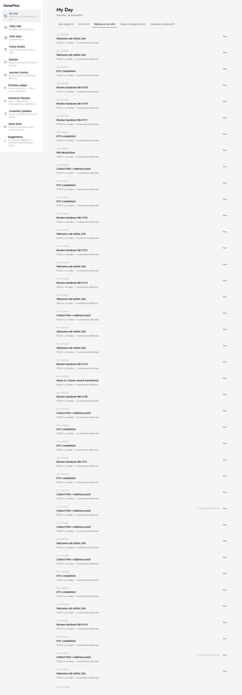

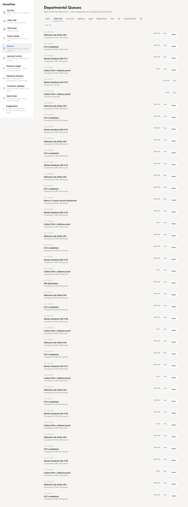

**Done when:** My Day is not an empty spinner; a queue row is claimed.

```
Login → My Day (ranked work) → Queues (claim) → work sits with you
```

---

## W02 — Find a home and hold a window

**Who:** `sales@`. **Person:** Tanvi Joshi. **Do not book V101.**

| Step | Screen | Do |
|---|---|---|
| 1 | Sales Desk | Inventory: gates already differ between units |
| 2 | Prospects | Tanvi Joshi is ACTIVE |
| 3 | Holds | V101 `kitchen_layout` APPROVED until a future date |
| 4 | Book dialog | Open Book on an **available** unit that is **not** V101/V104/V108 if you must demo the form — **do not submit** those three |

**Shots:** [w02-inventory.png](artifacts/w02-inventory.png), [w02-prospects.png](artifacts/w02-prospects.png), [w02-holds.png](artifacts/w02-holds.png).

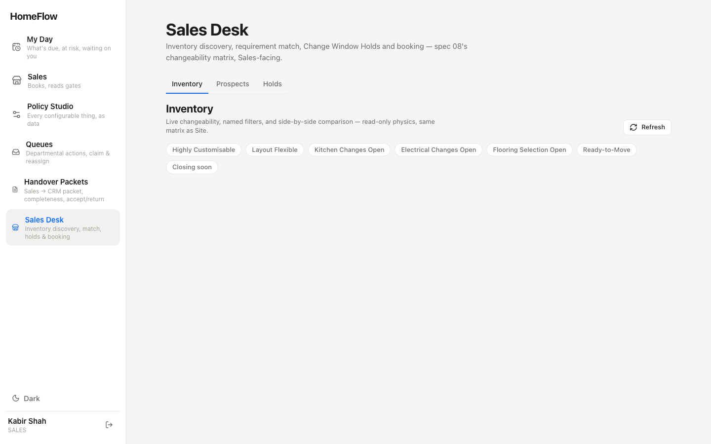

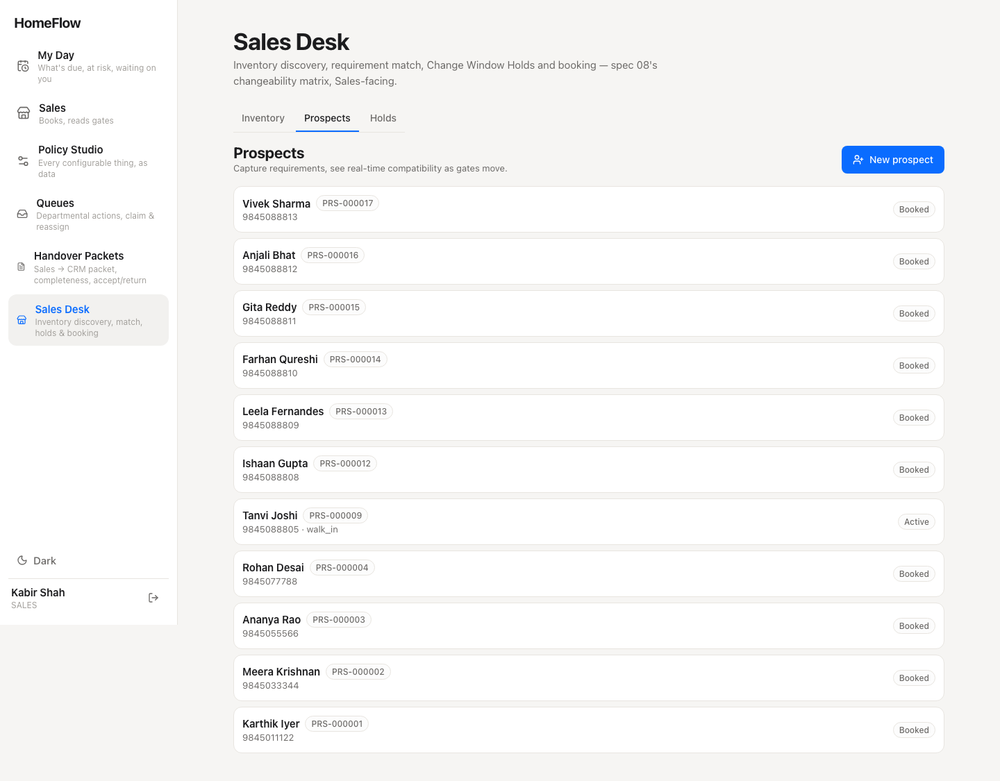

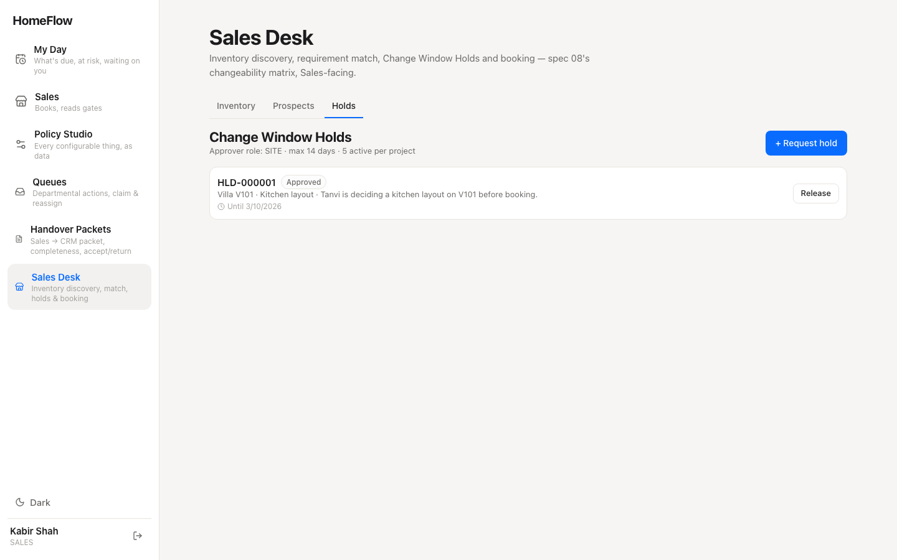

**Done when:** Sales can see live gates and an existing hold without creating a booking.

```
Site twin (already true) → Sales Desk inventory → prospect Tanvi → hold V101 kitchen
```

---

## W03 — Hand a file from Sales to CRM

**Who:** `superadmin@`, project **Pranava Meadows** (Aditi is Meadows). After reset Aditi is SUBMITTED, not accepted.

| Step | Screen | Do |
|---|---|---|
| 1 | Switch project | Pranava Meadows |
| 2 | Handover Packets | Aditi Bansal BK-MV01 submitted |
| 3 | Packet | Completeness score visible |
| 4 | Accept | CRM (not the submitter) **Accept** — journey will instantiate |

Harish BK-MV02 is the **return** variant (already returned). Do not use Karthik; he is already accepted.

**Shots:** [w03-packets-list.png](artifacts/w03-packets-list.png), [w03-aditi-packet.png](artifacts/w03-aditi-packet.png) (before accept).

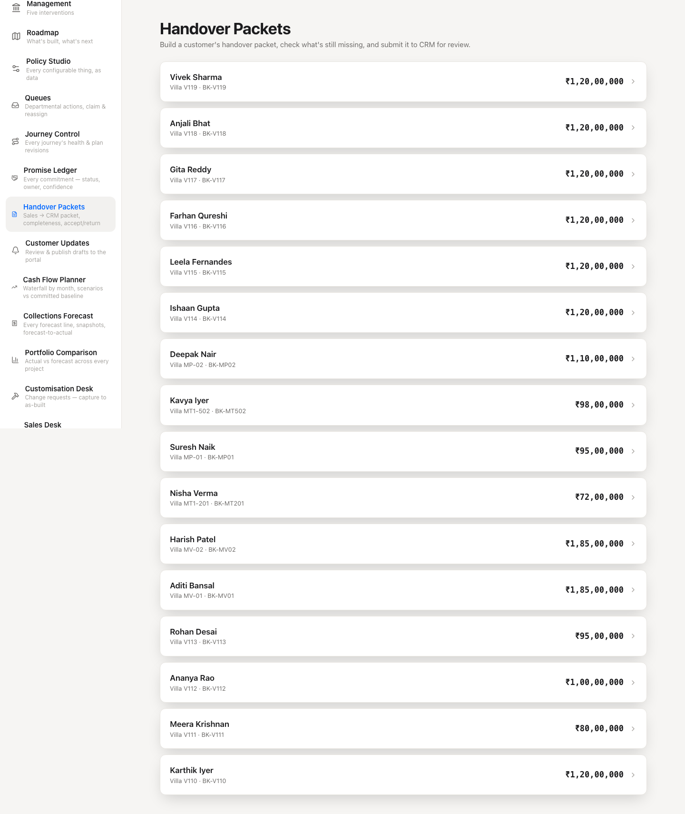

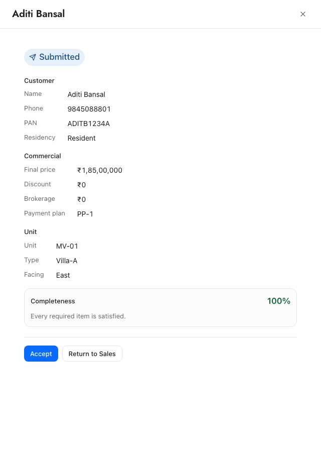

**Done when:** Before accept, no journey; after accept, CRM 360 Journey is not empty.  
**Note:** Accept mutates seed — reset when you need Aditi submitted again.

```
Sales completeness packet → CRM Accept or Return → journey starts only on Accept
```

---

## W04 — Keep the unit twin true

**Who:** `site@`. **Unit:** V110 Karthik. Sales must not be able to PATCH this.

| Step | Screen | Do |
|---|---|---|
| 1 | Project / Site | Open V110 |
| 2 | Progress | Record or verify a component (structure / MEP / flooring / finishing) |
| 3 | Gates | Changeability for a category has moved or stayed derived from physics |
| 4 | (negative) | `sales@` cannot edit site progress (403) |

**Shots:** [w04-v110-console.png](artifacts/w04-v110-console.png), [w04-gates.png](artifacts/w04-gates.png).

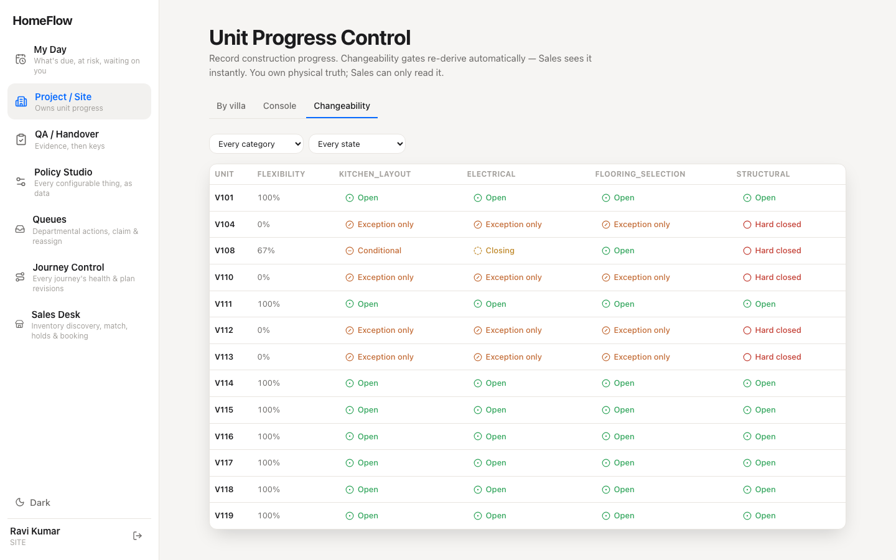

**Done when:** Progress is per component, not a typed %. Sales cannot write it.

```
Site records component state → gates re-derive (OPEN…HARD_CLOSED) → Sales reads only
```

---

## W05 — Collect what is due

**Who:** `accounts@`. **People:** Karthik (overdue with reason) and Farhan (cheque_bounce / default).

| Step | Screen | Do |
|---|---|---|
| 1 | Accounts | True-risk buckets; Karthik in overdue |
| 2 | Booking | Open Karthik; demands list; overdue reason + next action |
| 3 | Receipt | Post a receipt against a demand (or screenshot the post form) |
| 4 | Farhan | BK-V116 cheque_bounce, ~70d overdue |

**Shots:** [w05-collections.png](artifacts/w05-collections.png), [w05-karthik-demands.png](artifacts/w05-karthik-demands.png), [w05-farhan.png](artifacts/w05-farhan.png).

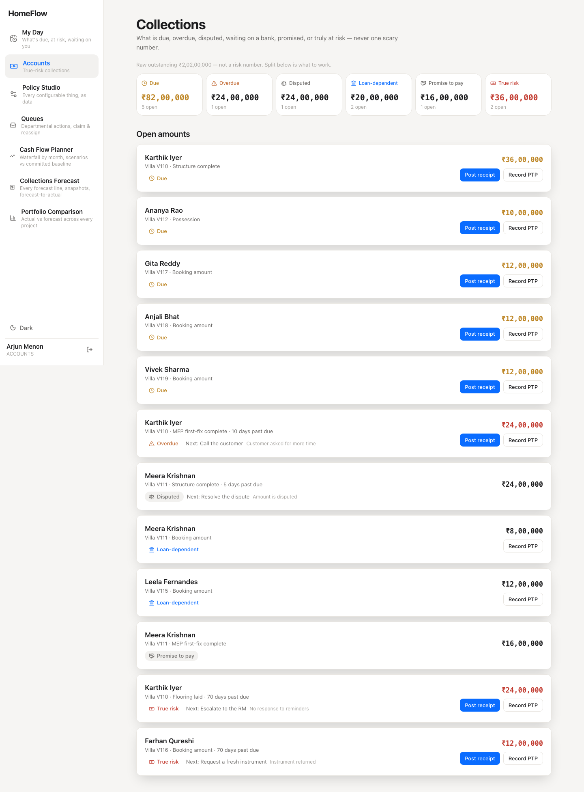

**Done when:** Overdue is not a blank amount; a reason code is visible. Money the role cannot see is "—".

```
Payment plan → demand (due_date when trigger fires) → receipt / PTP / waiver → true-risk bucket
```

---

## W06 — Work a change request

**Who:** `superadmin@`, project Meadows. **Person:** Nisha, CR Kitchen island, AWAITING_CUSTOMER.

| Step | Screen | Do |
|---|---|---|
| 1 | Customisation Desk | Row CR-000001, MT1-201, AWAITING_CUSTOMER |
| 2 | Drawer | Line items, quote, payment gate before site release |
| 3 | Site 360 | MT1-201 still an apartment with a booking |

**Shots:** [w06-desk.png](artifacts/w06-desk.png), [w06-cr-drawer.png](artifacts/w06-cr-drawer.png).

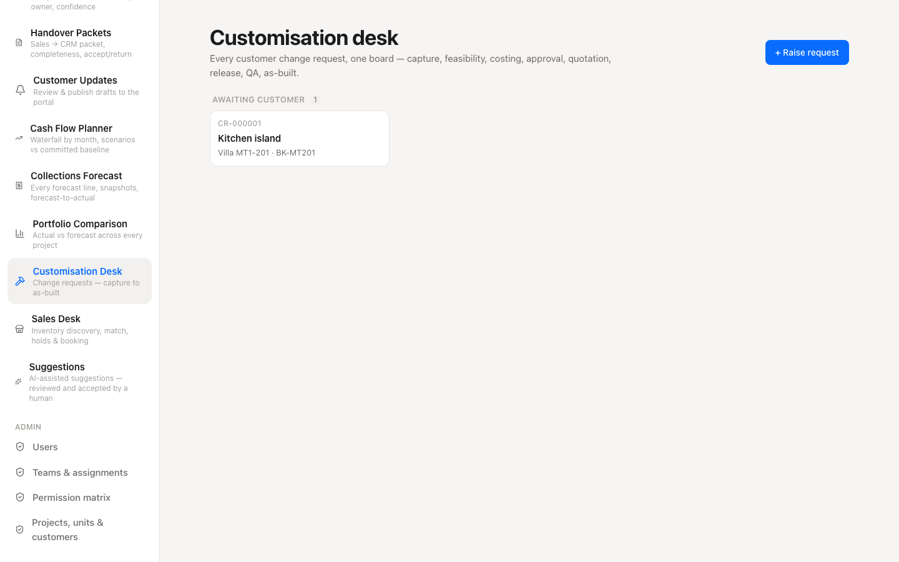

**Done when:** A WhatsApp-looking note is **not** the CR; the kanban row is the CR.

```
Capture CR (freeze gates) → feasibility → quote → customer accept / pay → drawing → as-built
```

---

## W07 — Make the Agreement of Sale

**Who:** `legal@` (Meadows: `superadmin@` + switch). **Person:** Kavya BK-MT502, AOS **draft**.

| Step | Screen | Do |
|---|---|---|
| 1 | Legal | Factory list; Kavya draft AOS |
| 2 | Document | Status DRAFT (not executed) |
| 3 | Contrast | Karthik has executed AOS if you open East Crest |

**Shots:** [w07-kavya-draft.png](artifacts/w07-kavya-draft.png).

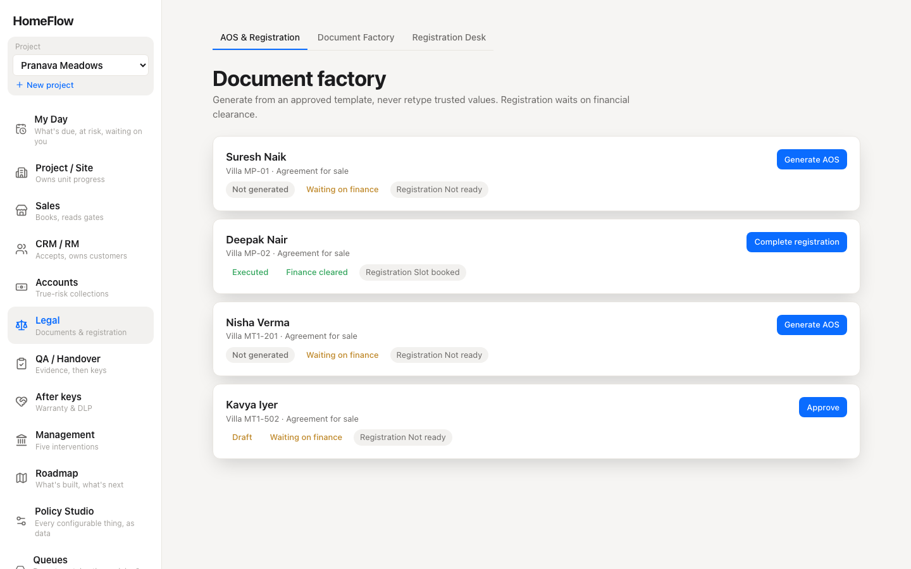

**Done when:** Draft and executed are different rows/statuses. No LEASE family required.

```
Template + clauses → generate (frozen snapshot) → approve → customer / wet execute
```

---

## W08 — Register the home

**Who:** `registration@` / `superadmin@`. **People:** Deepak MP-02 slot booked; Anjali V118 **blocked**.

| Step | Screen | Do |
|---|---|---|
| 1 | Legal / Registration | Deepak: slot booked, not completed |
| 2 | Anjali | Named blockers (docs / clearance / AOS) — cannot complete |
| 3 | Contrast | Ananya registration already completed |

**Shots:** [w08-deepak-slot.png](artifacts/w08-deepak-slot.png), [w08-anjali-blocked.png](artifacts/w08-anjali-blocked.png).

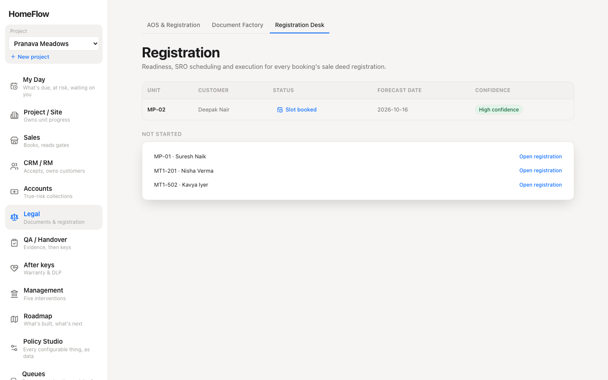

**Done when:** Blockers are named on the desk, not a silent disable.

```
Money + papers ready → SRO slot → day-of checklist → deed / receipt → unit registered
```

---

## W09 — Issue keys — or stop on a hard gate

**Who:** `qa@`. **People:** Ishaan V114 (appointment confirmed, keys not issued); Vivek V119 (CRITICAL snag).

| Step | Screen | Do |
|---|---|---|
| 1 | QA / Handover | Ishaan scheduled; checklist / signatures as file ids |
| 2 | Gates | Eight gates HARD/SOFT; complete only if eligible |
| 3 | Vivek | CRITICAL snag; complete is blocked without named override |
| 4 | Exceptions | QA exception queue is a **row list** |

**Shots:** [w09-ishaan.png](artifacts/w09-ishaan.png), [w09-vivek-blocked.png](artifacts/w09-vivek-blocked.png), [w09-exceptions.png](artifacts/w09-exceptions.png).

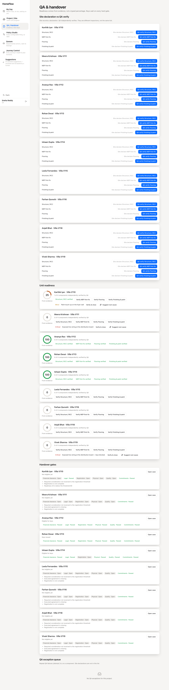

**Done when:** Keys are not a typed %; Vivek cannot skip the snag.

```
QA evidence + snags → 8-gate eval → appointment → checklist + signatures → keys / override
```

---

## W10 — Life after keys

**Who:** `fm@`. **Person:** Rohan V113.

| Step | Screen | Do |
|---|---|---|
| 1 | After keys | Rohan in DLP / post-handover |
| 2 | Passport | Home Passport items on the unit |
| 3 | Check-ins | 7 / 30 / 90 listed |

**Shots:** [w10-rohan-after.png](artifacts/w10-rohan-after.png), [w10-passport.png](artifacts/w10-passport.png).

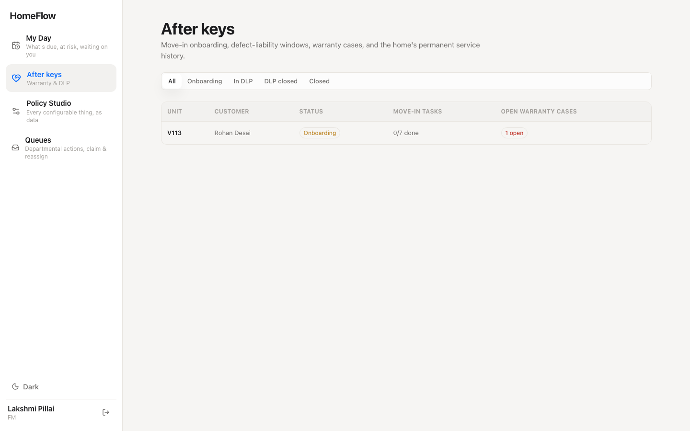

**Done when:** Passport is on the **unit**, not only the closed booking.

```
Handover completed → DLP windows → passport + warranty + service log + check-ins
```

---

## W11 — Act from the Control Tower

**Who:** `management@`.

| Step | Screen | Do |
|---|---|---|
| 1 | Management | Five interventions (customer, cash, handover, reputation, margin) |
| 2 | One card | Drivers + suggested act — not fifty charts |
| 3 | Act | Open Act on one intervention (or screenshot the pack) |

**Shots:** [w11-tower.png](artifacts/w11-tower.png), [w11-act.png](artifacts/w11-act.png).

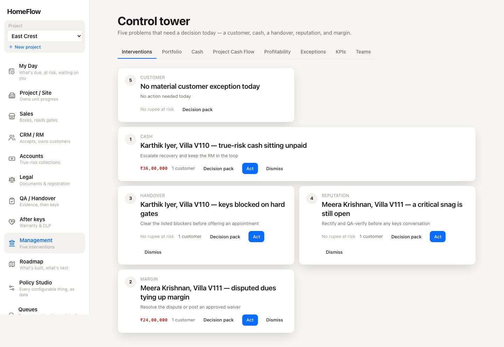

**Done when:** The page is five problems, not a dashboard wall.

```
Scores / KPIs (compute-on-read) → ranked intervention → Act / dismiss
```

---

## W12 — See my home (customer)

**Who:** `customer@demo.pranava` on `:5174`. **Person:** Ananya, V112, BK-V112.

| Step | Screen | Do |
|---|---|---|
| 1 | Login | Portal `/login` |
| 2 | Home | Hello Ananya / V112; keys outlook; no TRUE_RISK / vendor price |
| 3 | Journey | Customer-visible stages (may be empty until CRM publishes dates — staff 360 is populated) |
| 4 | Updates | Only published CRM items |

**Shots:** [w12-home-1440.png](artifacts/w12-home-1440.png), [w12-home-375.png](artifacts/w12-home-375.png), [w12-journey.png](artifacts/w12-journey.png).

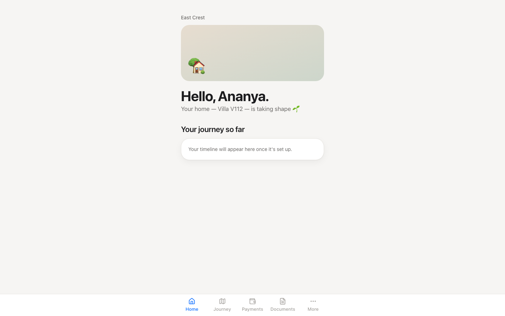

**Done when:** This login cannot open Karthik’s home.

```
Login (this booking only) → Home → Journey / Updates (published only)
```

---

## W13 — Pay and sign (customer)

**Same login as W12.**

| Step | Screen | Do |
|---|---|---|
| 1 | Payments | What is due and why; no internal buckets |
| 2 | Documents | What she must supply or sign |

**Shots:** [w13-payments.png](artifacts/w13-payments.png), [w13-documents.png](artifacts/w13-documents.png), [w13-payments-375.png](artifacts/w13-payments-375.png), [w13-documents-375.png](artifacts/w13-documents-375.png).

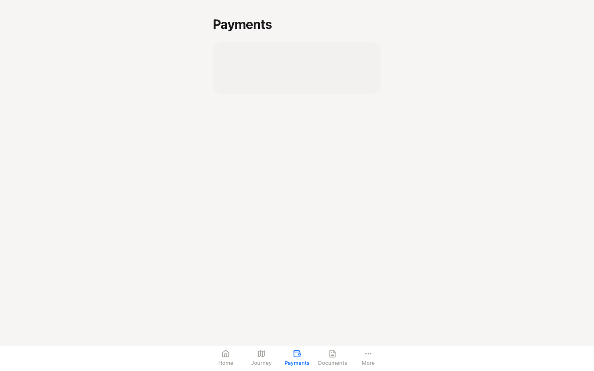

**Done when:** Copy is customer-safe; masked/internal fields absent.

```
Demand (customer wording) → pay / promise → documents to upload or e-sign
```

---

## W14 — Keys week and after (customer)

**Logins:** `ishaan@` then `rohan@`.

| Step | Screen | Do |
|---|---|---|
| 1 | Ishaan More → Handover | Appointment / keys window, not issued |
| 2 | Rohan More → Passport | Fittings; check-ins exist on staff side |

**Shots:** [w14-ishaan-handover.png](artifacts/w14-ishaan-handover.png), [w14-rohan-passport.png](artifacts/w14-rohan-passport.png), [w14-ishaan-handover-375.png](artifacts/w14-ishaan-handover-375.png), [w14-rohan-passport-375.png](artifacts/w14-rohan-passport-375.png).

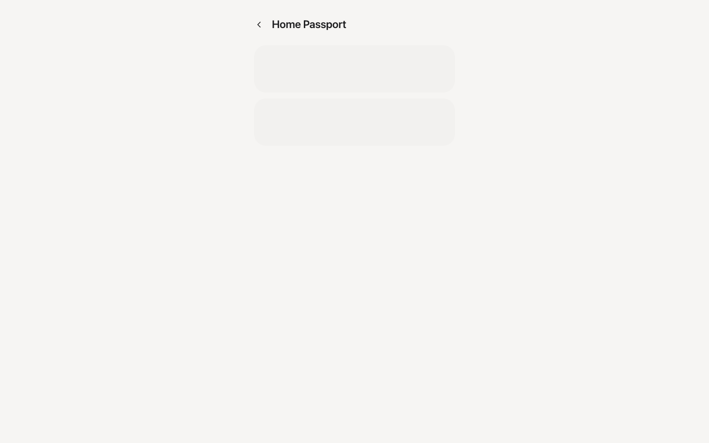

**Done when:** Ishaan is pre-keys; Rohan is post-keys; each sees only their unit.

```
Published handover slot → walkthrough → keys → passport stays with the home
```

---

## Supporting (not their own artifact)

Fold into the above if you mention them: Customer Updates (feeds W12), Promise ledger (feeds W06/W09), Journey Control plan revision (Karthik/Nisha dates), Policy Studio (config, not a customer journey), Admin invite (operator, not OS), Suggestions (human-accept only).
